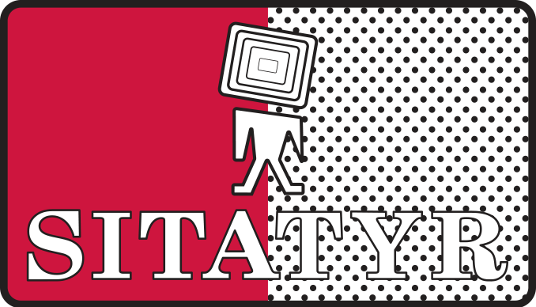

Yo nací en Guadalajara, pero crecí donde la señal llegaba con eco.
En mi pueblo, la televisión era más un milagro que un servicio: una antena vieja amarrada con alambre, un televisor que hacía más ruido que dar imagen y la esperanza de que, si se movía el viento, la imagen no se fuera con él.

Cuando tenía entre tres y cinco años, solo había TV abierta.
Nada de cable, ni satélite, ni control remoto que funcionara bien.
La antena era un artefacto sagrado, amarrada con alambre oxidado, orientada hacia un cerro, y cada canal era una pequeña victoria.
Si se veía algo, aunque fuera con interferencia, ya era suficiente.
Si llovía, se acababa la magia.
La tele en el campo no se apagaba, desaparecía.

A mis cinco años, llegó una nueva promesa al pueblo, "Telesistemas Tapatíos" (o algo así se llamaba; digámosle así por comodidad), una empresa local de cable que ofrecía el "paquete full".
No era IZZI ni SKY, pero era todo un avance.
De repente, la televisión dejó de depender del clima y empezó a depender de los técnicos del pueblo.

Telesistemas Tapatíos transmitía de todo: canales nacionales, noticieros extranjeros y, sin que nadie lo supiera, una retransmisión pirata de Cartoon Network tomada directamente de SKY TV.
Yo lo veía como algo normal, las caricaturas estaban ahí, las voces eran familiares y el logo de CN brillaba en la esquina.
Hasta que un día, entre un episodio de El Increíble Mundo de Gumball y otro de MAD (años más tarde, cuando la señal seguía igual de improvisada), apareció sobre la pantalla un texto legendario:

> “ESTA ES UNA RETRANSMISIÓN ILEGAL, DENÚNCIELA .I.”

Así, con emoticono y todo.
No sabía si reír o asustarme.
Duró un par de días y luego desapareció.
La transmisión siguió.
Ni SKY ni Cartoon Network hicieron nada.
El canal siguió como si nada.

A veces pienso que ese mensaje lo escribió algún técnico local, un acto de rebeldía o humor negro antes de ser despedido.
Una firma digital anónima que quedó grabada en mi memoria y probablemente en la de todo aquel que veía el mismo canal robado en Jalisco.

Mientras mis amigos de la Ciudad de México recuerdan *Once Niños* con ternura (el canal del IPN), los programas educativos, *Bizbirije*, *El Diván de Valentina*, *Zoboomafoo*, *31 Minutos*, yo crecí con *Nickelodeon*, *Disney XD*, *Big Time Rush*, *Drake y Josh* y caricaturas dobladas al español por *Candiani Dubbing Studios*.
No recuerdo haber visto el canal Once.
En el “paquete full” de Telesistemas, **los canales empezaban en el 22**, y del 22 hacia abajo no había nada.
Quizá *Once Niños* estaba ahí en algún otro canal, pero no era el 11.
Y, sinceramente, a esa edad yo no pasaba los canales buscando qué había, veía lo que salía o lo que me ponían, y con eso bastaba.

> “Ellos recuerdan a Once Niños, yo recuerdo los comerciales gringos mal doblados. Ellos tenían al IPN, yo tenía a Nickelodeon. Cada quien su señal, cada quien su infancia.”

Mis amigos capitalinos comparten una memoria televisiva común, como si todos hubieran crecido viendo la misma historia.
Yo, en cambio, tenía una infancia fragmentada, una mezcla de voces extranjeras y canales improvisados que, sin saberlo, me estaban educando de otra forma.

A mis 10 años y despues de mudarme a una zona del pueblo aún más foránea, llegó **Dish**.
La antena metálica parecía un plato gigante y prometía "señal digital" y "televisión moderna".
Durante los primeros meses todo era maravilla, la imagen nítida, los canales ordenados, la sensación de haber alcanzado el futuro.
Hasta que llegó la temporada de lluvias.

Cuando el cielo se nublaba, la pantalla se congelaba.
Primero el audio se distorsionaba, luego aparecían cuadros grises y finalmente la pantalla decía:

> *“Señal no disponible.”*

Era el sonido del vacío.
La familia entera quedaba mirando el reflejo azul del televisor, esperando que el satélite "volviera a alinearse con nosotros".

> “En la ciudad, perder internet es una tragedia. En el campo, perder la señal era perder la compañía.”

Así fue durante dos años: un ciclo entre la maravilla y el silencio.
Y cuando el contrato terminó, *volvimos a Telesistemas Tapatíos*.
El coaxial regresó a nuestras vidas, como un viejo amigo que no fallaba aunque estuviera lleno de interferencia.
Años después llegaría *Megacable*, más estable y moderno, pero sin aquella aura de caos entrañable.

Con el tiempo entendí que Telesistemas no era solo una empresa: era una obra de ingeniería que, de alguna manera, se mantenía estable.
En algún cuarto de Zacoalco de Torres, había un montón de cables, decodificadores de SKY, moduladores y splitters que alimentaban toda la red.
Uno o mas técnicos con paciencia y cinta aislante mantenían viva la televisión de cientos de casas.
Era televisión a mano, hecha con ingenio y una pizca de ilegalidad.
Por eso sobrevivía.

Y entre todos esos recuerdos, hay un sonido que nunca se borra: el del *SITATYR*.

Esa voz grave y solemne que interrumpía caricaturas para anunciar:

> “Los trabajadores de la televisión y la radio, llevaremos a cabo nuestra sexagesima octava asamblea general ordinaria del consejo nacional en Quintana Roo, inaugurando los trabajos del gobernador del estado”

Mientras mi mamá me peinaba para ir a la escuela, la tele se llenaba de ese mensaje.
Yo no sabía qué era un sindicato, pero lo escuchaba tan seguido que se volvió parte del paisaje.
Era un ritual burocrático disfrazado de anuncio público.

Años después supe que era un derecho sindical, los tiempos oficiales que Televisa y TV Azteca estaban "obligadas" a ceder un espacio para este anuncio.
Pero de niño me parecía fascinante que gente de la que nunca había escuchado hablar interrumpiera algun programa solo para contarnos que tendrían su asamblea.
Un evento solo para ellos, un anuncio transmitido para todos.

Ya de grande, conocí *Canal Once* y su historia con el IPN.
Y no pude evitar sentir envidia.
Ese canal sí había logrado ser un espacio educativo y crítico.
Mientras tanto, en Jalisco, lo más parecido era *UDG TV*, que en teoría era cultural, pero en la práctica es un escaparate institucional.
Ni crítica, ni autonomía, ni voz estudiantil.
Solo discursos preparados, actos académicos y comunicados perfectamente redactados.

Durante las protestas y la represión en Rectoría General del 10 y 11 de septiembre del 2025, *UDG TV y Radio UDG simplemente guardaron silencio.*
No mencionaron la represión ni los hechos violentos, eligieron no darle difusión al tema.
Quienes hablaron fueron otros medios locales, pagados o influenciados por la propia UDG, para manipular la narrativa y desinformar.
Los medios universitarios oficiales se limitaron a registrar lo inocuo:
la existencia de algunas asambleas estudiantiles, el diálogo con el secretario académico y los planes de marchas futuras.

> “La televisión universitaria aquí no informa, adorna. La UDG no quiere verse al espejo, prefiere un escaparate.”

A veces pienso que todo eso (la antena vieja, el cable con retransmision ilegal, los cortes de Dish, los anuncios sindicales, los medios vendidos) forman parte de lo que soy.
Soy parte de esa generación foránea que creció entre el silencio del campo y el ruido del mundo, entre lo improvisado y lo globalizado.

> “Quizá nunca tuve Canal Once, pero tuve historias, estática y un técnico que dejó su firma digital en la pantalla. Y eso también es memoria cultural.”

Crecer fuera de la Zona Metropolitana no te aísla, te enseña a mirar desde los bordes.
Y desde los bordes, todo se ve distinto.
Uno aprende a observar las cosas con distancia, a no creer del todo en la señal, y a encontrar belleza en el ruido.

Hoy la televisión ya no domina la casa.
Las antenas se oxidan, los cables se esconden, y las pantallas se conectan a internet.
Pero a veces, cuando el sonido se distorsiona o el video se congela, me acuerdo de esos días en que perder la señal era perder el mundo.

No crecí con televisión pública del todo, pero crecí con una televisión viva, humana, imperfecta, no tan legal.
Y aunque no era la televisión que México quería mostrar,
sí era la televisión que nosotros veíamos.
