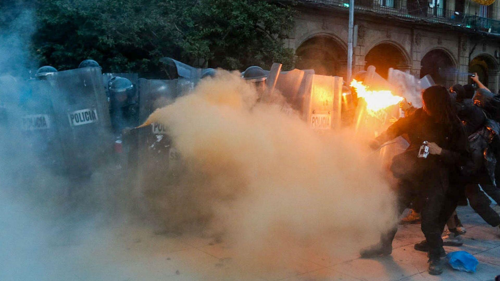

Cada 2 de octubre reaparece el mismo coro: los que critican desde la comodidad, los que descalifican a quienes protestamos, los que miran la lucha social con desprecio.
La mayoría de ellos ya no son estudiantes, ya no son jóvenes; son adultos mayores, gente cuarentona o más, que no pisa las aulas ni siente en carne propia las carencias que sufrimos.
Y sin embargo, ahí están, opinando como si les tocara heredar lo que viene.

La realidad es otra: el futuro no será suyo, será nuestro.
Nosotros somos los que viviremos con las consecuencias de este país y de esta universidad.
Y no podemos permitirnos quedarnos callados.

Nos critican porque hacemos asambleas, porque pintamos estatuas, porque paramos clases.
Y ahora también, porque en la Ciudad de México los jóvenes enfrentaron a la policía con molotovs, petardos y piedras.
No entienden que lo que pasa no es vandalismo gratuito: es la respuesta legítima de un pueblo que ya no se deja golpear ni reprimir.

Durante años se nos enseñó a agachar la cabeza, a soportar las cuotas ilegales, la corrupción, la violencia, el abandono.
Hoy esa pasividad se terminó.
El mensaje es claro: ya no tenemos miedo.
Si antes la policía bastaba para disuadir, hoy la gente devuelve el golpe.
Y eso quedará grabado en la memoria colectiva de una generación que entiende que los derechos se conquistan, no se mendigan.

La ironía es que quienes más nos atacan los que insultan en redes, los que llaman “vándalos” a los que protestan, los que dicen que “antes sí había respeto” son quienes menos tienen que perder.
Ellos ya no heredarán la universidad, ni el país, ni el desastre social que nos dejan.
Somos nosotros quienes cargaremos con ese peso.

Y que quede claro: no generalizo.
Sabemos que hubo generaciones que sí lucharon y todavía acompañan con dignidad.
Pero no son ellos quienes nos llaman “putitos” desde perfiles serviles, ni quienes aplauden que se criminalice a los estudiantes.
Los que lo hacen son los que prefieren un sistema corrupto e inmóvil, porque les da la comodidad de seguir su vida sin incomodarse.

A ellos les duele ver que las juventudes se levantan.
Les duele porque les recuerda que ellos mismos callaron demasiado tiempo.
Pero ya no estamos en su época, ni en su lógica de “aguantar”.
Estamos en un tiempo nuevo donde la dignidad no se negocia.

Así que sí, pueden llamarnos comunistas, revoltosos, radicales, lo que quieran.
Al final, seremos nosotros quienes heredemos esta tierra, esta universidad, este futuro.
Y lo vamos a reconstruir, aunque les moleste a los que prefieren la obediencia.

## Porque su tiempo se acaba. Y el nuestro apenas empieza.

_Porque las llamas que hoy pintan los muros no destruyen, iluminan.
Porque la rabia que llevamos dentro no busca caos, busca justicia.
Y porque la juventud que ellos desprecian será la misma que un día escriba la historia que ellos intentaron censurar._

_Que tiemblen los cómodos.
Que se incomoden los poderosos.
Porque los hijos del hartazgo ya despertamos.
Y no volveremos a dormir._

