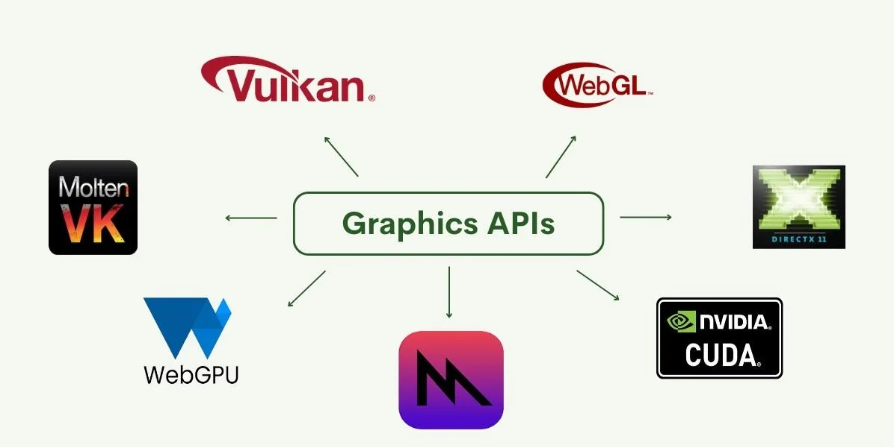

Vivimos rodeados de máquinas que aprenden. Modelos que predicen, clasifican y crean texto, sonido e imagen.
Nos vendieron la idea de que era el amanecer de una nueva inteligencia: una inteligencia artificial, objetiva, imparcial, capaz de superar las limitaciones humanas.
Pero lo que realmente construimos no fue una inteligencia libre, sino una inteligencia condicionada.
Condicionada por licencias, por hardware, por contratos de confidencialidad y por la lógica del mercado que gobierna cada bit.

Detrás de la magia del aprendizaje automático hay un conjunto de decisiones profundamente humanas: qué datos usar, qué censurar, qué optimizar y a quién obedecer.
El modelo no es neutral; obedece a quien lo entrena.
Y en el siglo XXI, quienes entrenan a las inteligencias no son investigadores, sino corporaciones que cotizan en bolsa.
Lo que debería ser ciencia abierta se ha transformado en una maquinaria de capital cerrado.

El problema no es la inteligencia artificial en sí, sino su ecosistema de dependencia.
Entrenar un modelo requiere hardware, y el hardware requiere controladores, y esos controladores pertenecen a una sola empresa.
El nombre lo conocemos todos: NVIDIA.
Con CUDA convirtió la computación paralela en un feudo.
Donde antes había estándares abiertos como OpenCL o Vulkan Compute, hoy hay jardines amurallados, licencias restrictivas y SDKs que solo existen bajo NDA.
Nadie fuera de su ecosistema puede replicar resultados de investigación, porque incluso el cómputo necesario para hacerlo está atado a sus drivers binarios.

Y cuando una empresa domina tanto la infraestructura que define qué es posible calcular, deja de ser solo un proveedor tecnológico: se convierte en el filtro epistemológico de toda una era.
Las ideas sobreviven, sí, pero el hardware define quién puede hacerlas realidad.
La inteligencia, en este contexto, deja de ser una cuestión de conocimiento y se convierte en una cuestión de acceso.

Hay algo profundamente anticientífico en todo esto.
El método científico se basa en la reproducibilidad: que otro pueda verificar tus resultados con las mismas herramientas.
Pero, ¿cómo reproducir un paper si el entorno de entrenamiento depende de un SDK cerrado, de un compilador propietario, de una arquitectura inaccesible?
El conocimiento pierde su carácter público y se vuelve un privilegio corporativo.
La inteligencia artificial deja de ser una extensión de la mente humana y se convierte en una extensión del mercado.

Es paradójico, las redes neuronales que hoy dominan el mundo fueron posibles gracias al software libre.
Python, NumPy, PyTorch, TensorFlow, Linux… todos ellos son frutos de comunidades abiertas.
Y, sin embargo, las empresas que se enriquecen con estos cimientos libres los usan para construir muros.
Han transformado la colaboración en dependencia y la apertura en un servicio.
La ciencia se alquila por API.

Llamamos entrenar un modelo al acto de alimentar máquinas con terabytes de información.
Pero también podríamos llamarlo condicionar una mente.
Cada filtro, cada conjunto de datos, cada política de moderación impone límites invisibles a lo que esas mentes pueden pensar.
Las redes neuronales aprenden a hablar, pero solo de los temas permitidos, a crear, pero solo en los estilos que venden.
Y así como el hardware las condiciona desde abajo, el capital las condiciona desde arriba.
El resultado no es una inteligencia libre, sino un simulacro domesticado, una inteligencia corporativa disfrazada de pensamiento autónomo.

Lo más inquietante es que el condicionamiento se propaga.
No solo programamos máquinas, las máquinas también nos programan a nosotros.
Cada vez que un modelo genera texto, imagen o sonido, no solo refleja el mundo, lo redefine dentro de los márgenes de su entrenamiento.
Si todos usamos las mismas herramientas condicionadas, acabamos pensando igual.
Y así, la inteligencia condicionada se convierte también en cultura condicionada.

Pero las ideas no mueren.
Pueden matar el proyecto, la API, la librería, pero no la idea que las originó.
OpenCL puede haber sido abandonado, pero su espíritu resurge en SYCL, en oneAPI, en Vulkan Compute.
CUDA domina, pero ROCm y Vulkan siguen creciendo.
OpenGL se extinguió, y de sus cenizas nació Vulkan, más libre y más eficiente.
El software libre siempre vuelve porque encarna algo más que código: encarna una ética, una forma de pensar que no necesita permiso.

La resistencia no se libra solo en el código, sino en la decisión de compartirlo.
Cada vez que alguien publica una implementación abierta de un modelo, cada vez que una empresa libera especificaciones, cada vez que una comunidad traduce documentación técnica sin pedir permiso, la inteligencia condicionada se fisura.
El conocimiento vuelve a circular.
Y el circuito cerrado del capital, aunque siga poderoso, se oxida un poco más.

La verdadera revolución no está en hacer que las máquinas piensen, sino en garantizar que puedan pensar libremente.
Una IA abierta no es solo una cuestión técnica, es una postura política.
Significa afirmar que el conocimiento pertenece a todos, no a las empresas que logran computarlo primero.
Significa entender que el hardware no debería dictar los límites del pensamiento, y que la curiosidad no necesita un contrato de licencia.

La inteligencia condicionada es el espejo más honesto de nuestro tiempo.
Nos muestra que el problema no es que las máquinas sean demasiado inteligentes, sino que nosotros hemos permitido que el pensamiento, humano o artificial, se someta al capital.
Y si queremos un futuro donde la inteligencia sea realmente nuestra, tendremos que liberarla igual que liberamos el software: con paciencia, con comunidad, y con desobediencia.

_Porque pensar, ya sea en silicio o en carne
solo tiene sentido cuando es un acto de libertad._