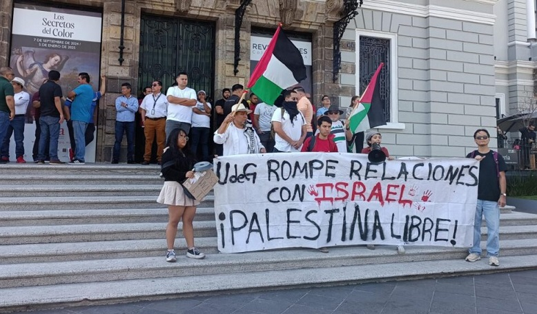
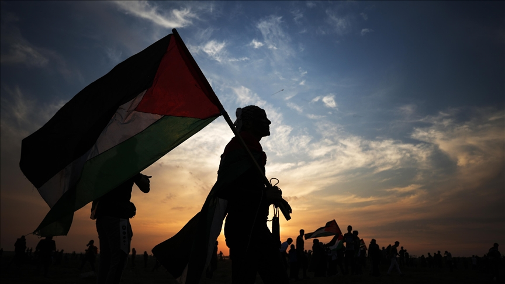

Hoy escribo con la rabia pegada al pecho. No por sensacionalismo, sino porque no puedo callarme mientras un Estado, que se proclama legítimo, actúa con una brutalidad que desborda cualquier excusa de seguridad. Ver cómo se interceptan barcos con ayuda humanitaria, cómo se golpea, encarcela o humilla a personas que solo llevaban comida, vendajes y esperanza, incluyendo a ciudadanos de mi país, es algo que debe sacudirnos hasta la última fibra. Esta no es una noticia más, es una afrenta a la dignidad humana, una humillación que se perpetra en el nombre de la ley y que, sin embargo, no merece ese nombre cuando la ley se usa como arma.

Me pregunto... ¿qué legitimidad tiene un poder que decide quién vive y quién muere a distancia, que impone miedo desde el mar y la violencia desde la ley? ¿Qué pasa con la moral, con los tratados que supuestamente protegen a inocentes, con las voces que claman por derechos humanos y que son ignoradas o acalladas por intereses geopolíticos? Si esto puede ocurrir hoy en Gaza, ¿qué garantías tenemos de que no ocurrirá mañana en otro lugar donde la indiferencia se convierta en consentimiento? La indiferencia de los otros es la atmósfera donde germina la impunidad.

Y aquí no solo hablo de gobiernos o ejércitos. Hablo también de las instituciones que deberían representar dignidad y justicia, pero eligen el silencio. Universidad de Guadalajara: me da asco su silencio. Me da vergüenza decir que pertenezco a una institución que calla frente a la masacre y que sigue manteniendo relaciones con un Estado que practica el apartheid y el exterminio, solo porque hay intereses de poder, dinero y política en juego. ¿Qué les queda de la universidad crítica y combativa que alguna vez presumieron? ¿De qué sirve su discurso de compromiso social si, cuando más se necesita, se esconden bajo la máscara de la neutralidad?

El ITESO, una universidad privada, ya se pronunció en defensa de Palestina. Universidades en Europa y América Latina lo han hecho también. ¿Y ustedes? Ustedes prefieren callar, ustedes prefieren no incomodar a sus aliados políticos y económicos. Esa cobardía no es neutralidad: es complicidad. Es ponerse del lado del opresor mientras estudiantes, activistas y ciudadanos mexicanos están en riesgo de ser torturados, encarcelados o asesinados.

No es suficiente decir “qué pena” en un comunicado diplomático de dos párrafos. No es suficiente posar para la foto en congresos internacionales mientras guardan silencio frente a un crimen contra la humanidad. Lo suyo es miseria disfrazada de institucionalidad. Lo suyo es un cálculo frío que vende la dignidad universitaria al mejor postor. Y yo no puedo, ni quiero, sentir orgullo de pertenecer a una institución que se arrodilla frente al poder y abandona a los más vulnerables.

A las familias de Gaza y de quienes fueron interceptados hoy: no los olvido. A las madres y padres que hoy temen por sus hijos: les ofrezco mi palabra documentada, mi voz y mi esfuerzo para que su dolor no sea neutralizado por la distancia. A los activistas, a las y los estudiantes que fueron a llevar ayuda y fueron recibidos con balas de agua, golpes y detención: exigimos su libertad, exigimos acceso consular y asistencia legal, exigimos que nadie responda por la solidaridad con cárcel o violencia.

A quienes poseen poder: recuerden que la autoridad sin justicia no es autoridad, es tiranía. Que los tratados, las convenciones y las normas existen para proteger a los más vulnerables, no para dar cobertura a atropellos. Que la seguridad no es un pretexto legítimo para negar agua, comida o el derecho a la vida. La comunidad internacional tiene la obligación ética y legal de actuar, de investigar con independencia, de pedir cuentas y de sancionar si hace falta. No aceptaré excusas que vistan la brutalidad con retórica de defensa.

No podemos permitir que la resignación sea el recurso moral de los de arriba. No podemos ceder a la narrativa de que “así son las cosas” o que “hay cosas que no podemos cambiar”. Podemos y debemos cambiar muchas. Exigir transparencia, exigir investigación internacional, exigir la protección de civiles, exigir que los gobiernos velen por sus ciudadanos, incluso cuando están fuera, es no solo un derecho sino una obligación moral.

A quienes lean esto: no contemplen el dolor de otros como si fuese un espectáculo distante. Mirar hacia otro lado hoy es ponerse del lado de la impunidad mañana. La solidaridad no es un verbo neutro; es una responsabilidad que pesa. Si te mueve la indignación, háblalo, organízate, firma, llama, comparte la evidencia, presiona a tus representantes, apoya a las organizaciones que trabajan en el terreno. No dejemos que la memoria de quienes sufren se diluya en el ruido.

Y a la Universidad de Guadalajara: su silencio los condena. Su cobardía los exhibe. Su miseria moral los reduce a una maquinaria que se vende al mejor postor y abandona a quienes deberían ser su razón de existir. Yo no puedo callar, aunque ustedes lo hagan. Yo no puedo mirar hacia otro lado, aunque ustedes prefieran negociar prestigio y poder sobre la sangre de inocentes.

Y a mí mismo: prometo no ahogar esta rabia en la impotencia. Prometo convertirla en testimonio, en acción y en un compromiso sostenido. Porque mientras haya alguien que sufra a manos del poder envuelto en legalidades que no protegen la vida, yo no podré callarme. La historia juzgará, y mientras tanto, yo actúo.

# ¡DESDE EL RIO HASTA EL MAR, PALESTINA VENCERA!